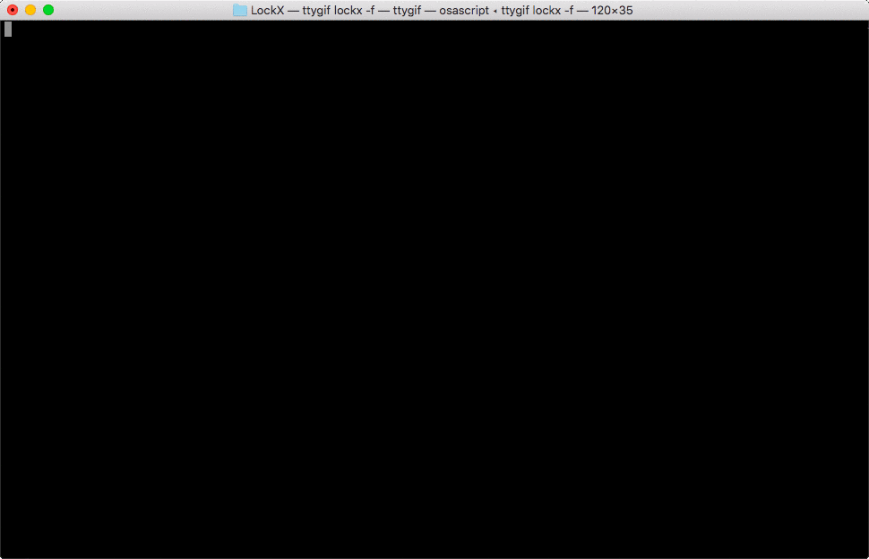

# LockX
锁住代码片段，缓存等待队列，控制并发

[](https://travis-ci.org/zhoumingque/LockX)
[](https://www.npmjs.com/package/lockx)
[](https://www.npmjs.com/package/lockx)
[](https://app.fossa.io/projects/git%2Bgithub.com%2Fzhoumingque%2FLockX?ref=badge_shield)

## Install
[](https://nodei.co/npm/lockx/)
```
$ npm i lockx --save
```

## Interactive UI
[](https://nodei.co/npm/lockx/)

## Dev
```javascript
const Lock = require('lockx');


const lockName = 'test';
let index = 10;

while (index-- > 0) {

  Lock.lock(lockName, { index }, async function (data) {

    console.log('\n----lock----', data);
    let result = void (0);

    try {

      result = await doSomeing();
      console.log('result->',result);

    } catch (error) {

      console.error('error->',error);

    } finally {

      console.log('----unlock----\n');
      Lock.unlock(lockName);

    }
  });

}

function doSomeing() {
  return new Promise((resolve, reject) => {

    let time = Math.floor(Math.random() * 10);
    let red = '\033[0;31;1m';
    let normal = '\033[40;37m\033[0m';
    let green = '\033[0;32;1m';

    setTimeout(() => {
      resolve(time < 5 ? `${green}小于5s${normal}` : `${red}大于5s${normal}`);
    }, time * 500);

  });
}
```
## 温馨提醒
`lockx`没有设置过期清除，所以要保证`lock`后一定要`unlock`，强烈建议用上`try/catch`
